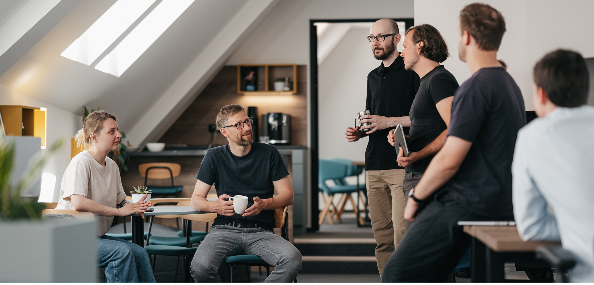

# Hey, this is us 👋

We're **Argo22** — a software development agency from the Czech Republic. We build web and mobile apps, e-commerce solutions, and AI integrations for clients across energy, fintech, retail and more.

We're spec-driven and architecture-first. That means we start with a solid plan — not a sprint zero that turns into a rewrite three months later.

---

### 🛠️ What we build with

Our stack revolves around **TypeScript**. React and Next.js on the frontend, NestJS on the backend, React Native for mobile.

That said, every project is an opportunity to choose the right tool, not just the comfortable one. We pick the stack that fits the problem — and we've integrated with everything from SAP to banking APIs along the way.

No vendor lock-in. Ever.

---

### 🔒 Why this profile looks quiet

Almost everything we build lives in **private repositories** — client code stays out of competitors' sight, and that's a promise we take seriously. What you see here isn't a fair representation of what we actually do.

If you want to see real work: **[argo22.com/reference](https://argo22.com/reference)** has case studies and references from clients who let us talk about their projects.

---

### 🙋 We're hiring

We're always looking for developers who care about doing things properly — good architecture, real ownership, and work that ends up in production, not a drawer.

👉 **Open positions: [argo22.com/kariera](https://argo22.com/kariera)**
